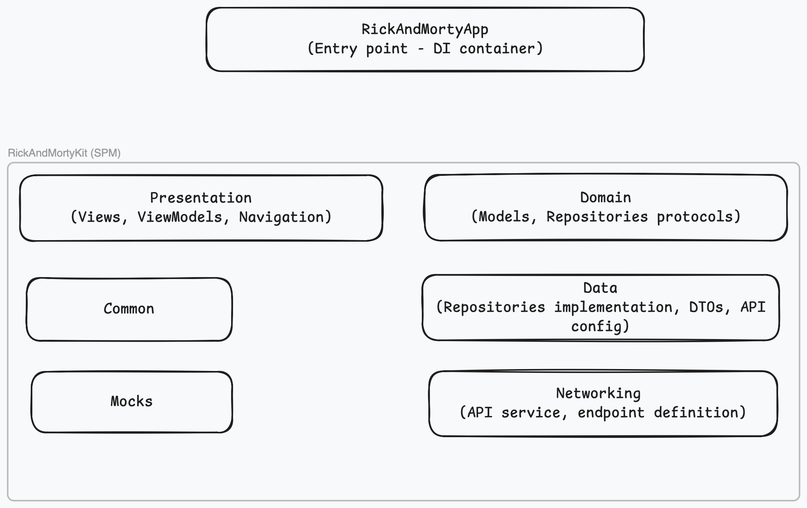

# RickAndMortyApp

I ended up using a different API since Marvel API looks like is no longer supported.

I used [Rick and Morty API](https://rickandmortyapi.com) that provides a similar concept of Charactars and Character detail.

The app was build from the ground up using SwiftUI and modern techologies like approachable concurrency, Observation, modularization via SPM, `NavigationStack`, etc. 

Regarding implemented features: users can scroll through a paginated list, search by name, and view detailed character information.

## Architecture

The project follows **MVVM** with a modular **Swift Package Manager** structure. 

All core logic lives in the `RickAndMortyKit` local package, while the main app target handles only dependency injection and the entry point.

### Modules

| Module | Purpose | Dependencies |
|---|---|---|
| **Common** | Shared utilities — generic `State<Content>` enum for async state management, `URL` extensions | None |
| **Domain** | Business models (`Character`, `Page`, `Paginated`) and the `CharactersRepositoryProtocol` | None |
| **Networking** | HTTP abstraction — `APIService`, `APIEndpoint`, `APIServiceError` | None |
| **Data** | Repository implementation, DTO-to-domain mapping, API endpoint configuration | Common, Domain, Networking |
| **Mocks** | Mock data and `MockCharactersRepository` for previews and tests | Domain |
| **Presentation** | SwiftUI views, `CharactersListViewModel` (`@Observable`), navigation flow via `CharactersFlow` | Common, Domain, Mocks, Kingfisher |

### Key patterns

- **MVVM** — `CharactersListViewModel` holds state and business logic; views are purely declarative.
- **Protocol-based DI** — `CharactersRepositoryProtocol` enable swapping implementations for testing.
- **Composition Root** — `DependenciesContainer` in the app target wires all concrete types and conforms to factory protocols.
- **Async/Await** — All asynchronous operations use structured concurrency with `@MainActor` isolation.
- **`@Observable`** — iOS 17+ observation for reactive UI updates without Combine.
- **State machine** — `State<Content>` enum enforces valid states and transitions (idle → loading → loaded/error).
- **DTO mapping** — `CharacaterDto.toDomain()` keeps API response shapes out of the domain layer.
- **Debounced search** — 300ms delay with `Task.isCancelled` check to reduce API calls.
- **Infinite scroll** — Pagination via `Page.nextPage`, triggered when the last item appears.

## Tech stack

| | |
|---|---|
| UI | SwiftUI |
| Concurrency | async/await, @MainActor, @Observable |
| Networking | URLSession |
| Image loading | [Kingfisher](https://github.com/onevcat/Kingfisher) 8.x |
| Testing | Swift Testing framework |
| Min deployment | iOS 17 |

## Tests

Unit tests for `CharactersListViewModel` live in `RickAndMortyKit/Tests/PresentationTests`.
